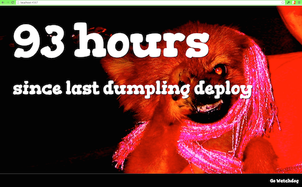

Go Watchdog
===========

This information radiator watches the event feed for the awesome open-source build and deploy server, [Go.CD](http://www.go.cd).  The longer it has been since a green build, the angrier the watchdog will appear.

I use it to monitor [Mingle's](http://getmingle.io) last deploy to staging pipeline.

Snap CI build status:

Setup
=====

    > gem install go_watchdog

    > go_watchdog

The first time it runs, it will generate an example config file that you must change to point to the pipeline you want the watchdog to watch.

Once you have the config the way you want, run it again.

    > go_watchdog

Put [http://localhost:4567/](http://localhost:4567/) up on an information radiator.

If things aren't what they seem, try deleting the ~/.last-green-go-pipeline-cache folder.

Feedback
========

If you have any comments, complaints, or questions, please open a GitHub issue.
